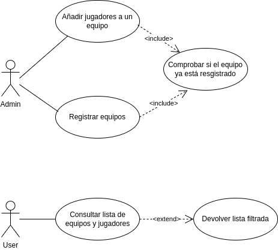
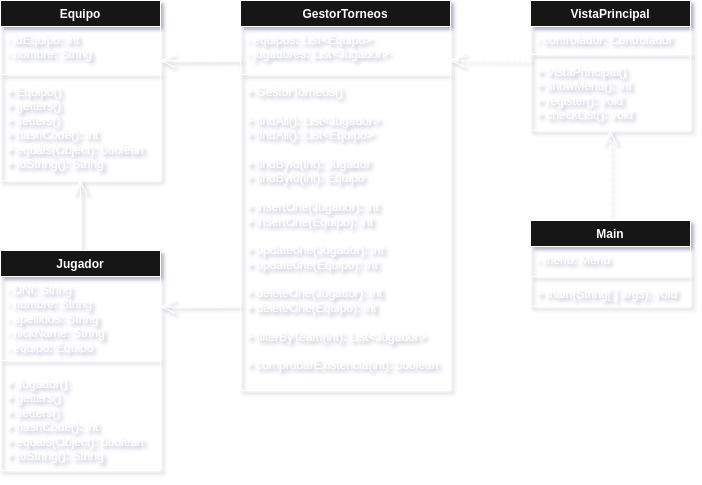

# ⚽ **Sistema de Gestión de Torneos de eSports**

## 👤 Autor
Andrés Bella Canet  
GitHub: andresBella98

## 📚 Descripción del Proyecto
Este proyecto implementa un sistema de gestión de torneos de eSports
utilizando UML para el modelado y Java para la implementación.  
  
🔗*Link del repo:* https://github.com/andresBella96/torneo-esports-uml-andres.git

## 🧩 Diagramas UML

### Diagrama de Casos de Uso

### Diagrama de Clases

## 📝 Justificación del diseño
Primero, se van a responder a las preguntas planteadas en el pdf de la actividad.  

#### *¿Quiénes son los actores que interactúan con el sistema?*  
  
Los actores que interactuan en el sistema serían el **Administrador** y el **Usuario**.  

#### *¿Cuáles son las acciones que cada actor puede realizar?*  
  
- **Administrador**: Registrar equipos y añadir jugadores.  
- **Usuario**: Consultar jugadores y equipos.  

#### *¿Cómo se relacionan entre sí las entidades del sistema?*  
  
Como entidades definimos aquellas entes que son únicas y se definen a partir de atributos, 
con lo que en este sistema se decide establecer como entidades a **Jugador** y **Equipo**.  
  
Estas entidades además tienen una relación de **1:n**, pues pueden haber muchos jugadores pertenecientes
a un equipo y un jugador solo pertenece a un equipo.

_________________________________________________________________________________________________________

#### *Clases y sus relaciones*  
Las clases del sistema se componen de las clases entidad, **Jugador** y **Equipo**, de control,
**Gestión**, y vista **Menu**.

## 🏁 Conclusiones
Sobre el aprendizaje obtenido.

