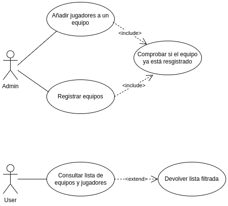

# ⚽ Sistema de Gestión de Torneos de eSports

## 👤 Autor
Andrés Bella Canet  
GitHub: andresBella98

## 📚 Descripción del Proyecto
Este proyecto implementa un sistema de gestión de torneos de eSports
utilizando UML para el modelado y Java para la implementación.  
Link del repo: https://github.com/andresBella96/torneo-esports-uml-andres.git

## 🧩 Diagramas UML

### Diagrama de Casos de Uso

### Diagrama de Clases

## 📝 Justificación del diseño
Por qué se eligió esa estructura y cómo se organizan las clases.

## 🏁 Conclusiones
Sobre el aprendizaje obtenido.

